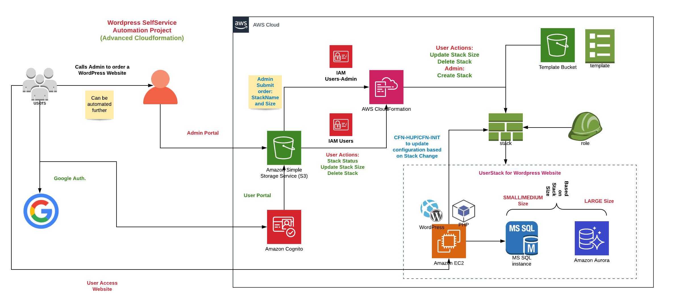
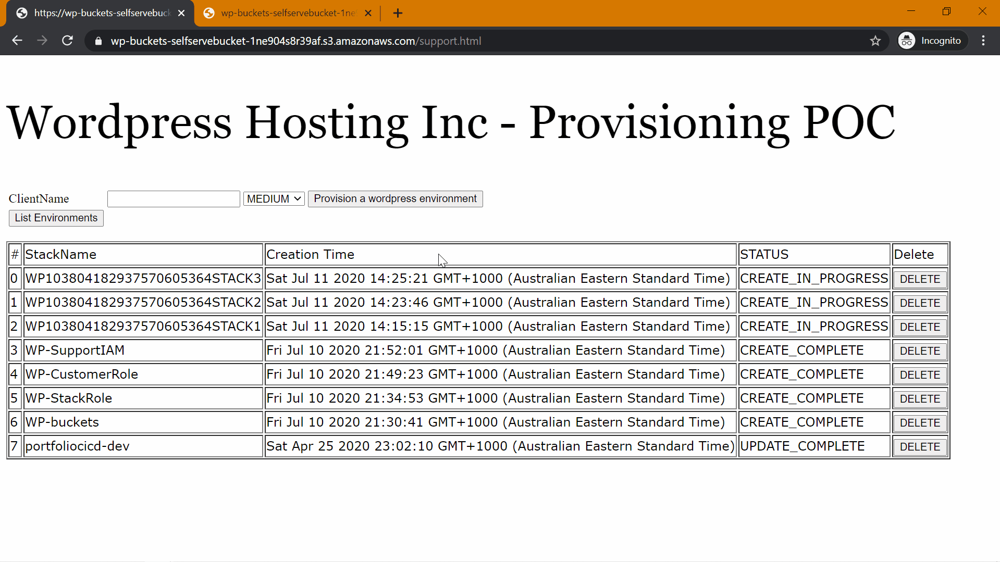

# AWS-CloudFormation
This project is aim to learn core and advanced components of AWS CloudFormation.

## Introduction to CloudFormation
- Simple EC2 Resource creation (Resource, Tags)
- CFN- Parameters, Mappings, Outputs and Intrinsic functions like Ref , GetAtt etc.
- CFN- Init (packages, files, services, commands), UserData

## Advanced CloudFormation
- UserData to install wordpress on EC2.
- CFN Init,configSets, hup to write software requirement declarative way.
- CFN CreationPolicy, DeletionPolicy during creation and deletion.
- CFN Intrinsic functions like Conditions.
- Enhance CFN Init to automate wordpress configuration.

## Self Service Portal
- Resource and Self Service Bucket Provisioning.
- Support IAM user.
- Role for CloudFormation Stack.
- Customer role for Users to update and delete stack.
- Google Authentication Setup (Manual). Create an API for Google Authentication.
- AWS Congnito Setup(Manual)- Create an Identity Pool and add Authentication with Google+. Add created Role from template. To be automated.
- Support html setup and upload into S3.
- Self Service html setup and upload into S3.
- Upload Wordpress CFN template into S3 Bucket.
### Architecture

### Website Demo

