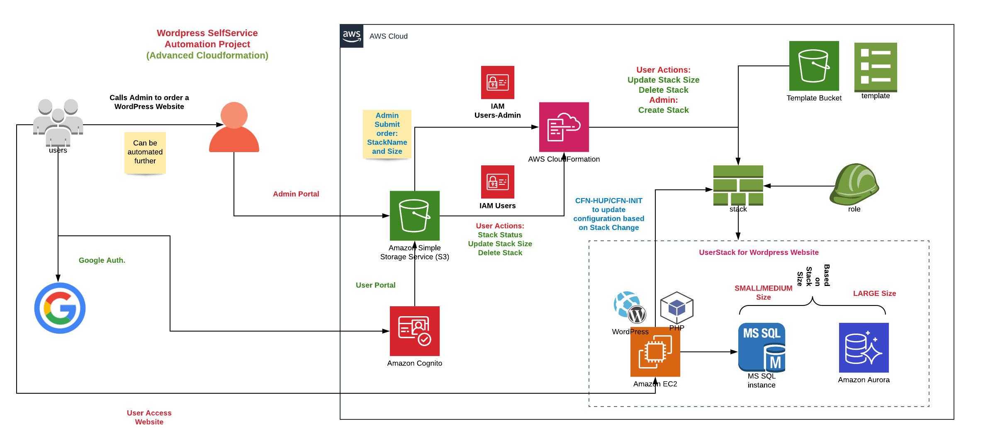
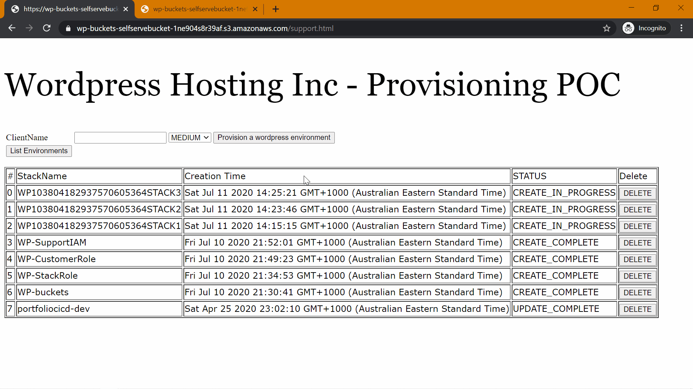
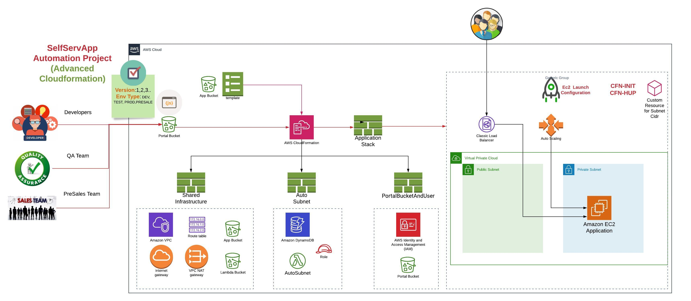

# AWS-CloudFormation
This project is aim to learn core and advanced components of AWS CloudFormation.

## Introduction to CloudFormation
- Simple EC2 Resource creation (Resource, Tags)
- CFN- Parameters, Mappings, Outputs and Intrinsic functions like Ref , GetAtt etc.
- CFN- Init (packages, files, services, commands), UserData

## Advanced CloudFormation
- UserData to install wordpress on EC2.
- CFN Init,configSets, hup to write software requirement declarative way.
- CFN CreationPolicy, DeletionPolicy during creation and deletion.
- CFN Intrinsic functions like Conditions.
- Enhance CFN Init to automate wordpress configuration.

## Self Service Portal
- Resource and Self Service Bucket Provisioning.
- Support IAM user.
- Role for CloudFormation Stack.
- Customer role for Users to update and delete stack.
- Google Authentication Setup (Manual). Create an API for Google Authentication.
- AWS Congnito Setup(Manual)- Create an Identity Pool and add Authentication with Google+. Add created Role from template. To be automated.
- Support html setup and upload into S3.
- Self Service html setup and upload into S3.
- Upload Wordpress CFN template into S3 Bucket.
### Architecture

### Website Demo

## Self Service App
This project is based on the concept of self service portal for Developers, Testers and PreSales guys who wants their infrastructure available on demand.
Hows that when the Presales team is presenting a demo and client requested for a different version of the application, Presales person just clicked a button and a verified and tested application with required infrastructure is spun up. Or even you want to develop a new feature of the application, you just hit a button and start coding on a standalone instance instead of having DEV/TEST version environments and multiple developers working on the same instance.
Continuing learnings of Advanced Cloudformation at A Cloud Guru
In this project, We solved three problems
1: User has to enter shared infrastructure stack values like VPC Id and other => Solved using Inter Stack references.
2: No test of application for success(creation policy) on updates of the stack. => Solved by using Autoscaling AutoScalingReplacingUpdate functionality.
3: Manual inputs for the Subnets CIDR range for application stack. => Solved by using CustomResource in cfn which uses a Lambda with DynamoDB to generate valid CIDR range automatically during stack creation.

### Architecture

### Website Demo

